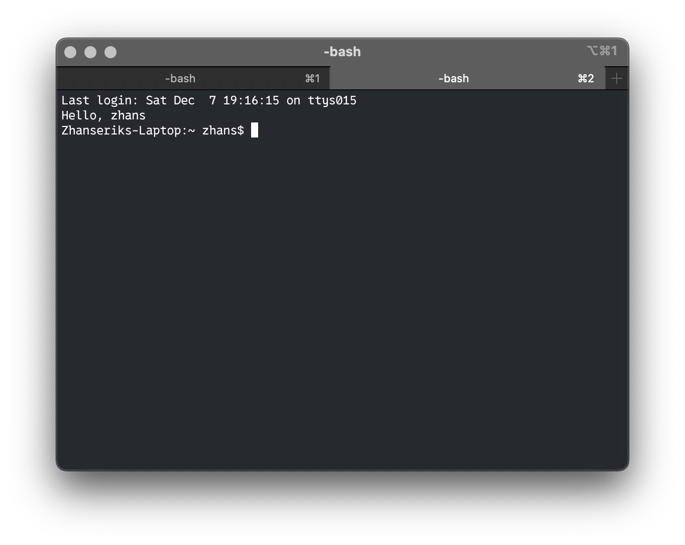

# Say "Hello, \<username>!"

## Task description

0.1 Make changes on your computer so that whenever a new terminal session is started you see `Hello, <username>`. For example – “Hello, roman”.

## Making

### Linux

Easiest task for today :)

Just add

```bash
echo "Hello, $(whoami)!"
```

at the end of file `~/.bashrc` and after that update the terminal with command.

```bash
source ~/.bashrc
```

Full code:

```bash
echo 'echo "Hello, $(whoami)"' >> ~/.bashrc && source ~/.bashrc
```

### macOS

Similar to Linux, but add the line of code to `~/.bash_profile`

Full code:

```bash
echo 'echo "Hello, $(whoami)"' >> ~/.bash_profile && source ~/.bash_profile
```

> [!NOTE]
> If you are using zsh for macos, just change every string of bash to zsh.
> If you work with bash, and want to put away the **annoying warning**
>
> ```bash
> The default interactive shell is now zsh.
> To update your account to use zsh, please run `chsh -s /bin/zsh`.
> For more details, please visit https://support.apple.com/kb/HT208050.
> ```
>
> you can add that `export BASH_SILENCE_DEPRECATION_WARNING=1` in file `~/.bash_profile` and after refresh, you can forget about warning
>
> ```bash
> echo 'export BASH_SILENCE_DEPRECATION_WARNING=1' >> ~/.bash_profile && source ~/.bash_profile
> ```

## Result


