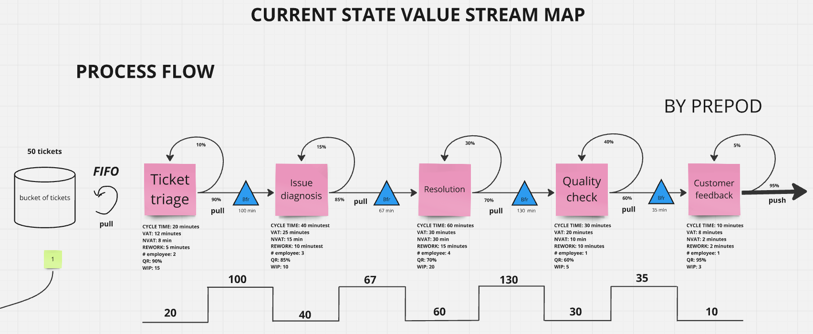

## **Value Stream Mapping (VSM) - Help Project Manager streamline processes**  
   Using Value Stream Mapping (VSM) to analyze and streamline the operational efficiency of a 11-member customer support team. The goal is to identify inefficiencies and enhance overall team performance to reduce delays and improve customer satisfaction ratings to help project manager with streamline processes

### Here our VSM task - https://miro.com/app/board/uXjVL5xrtCo=/


## Data for Analyze

| **Stage**             | **Cycle Time (CT)** | **Value-Added Time (VAT)** | **Rework Time** | **# of Employees** | **Quality Rate (%)** | **Work in Progress (WIP)** |
|------------------------|---------------------|----------------------------|-----------------|--------------------|-----------------------|----------------------------|
| **Ticket triage**      | 20 mins            | 12 mins                   | 5 mins          | 2                  | 90%                  | 15                         |
| **Issue diagnosis**    | 40 mins            | 25 mins                   | 10 mins         | 3                  | 85%                  | 10                         |
| **Resolution**         | 60 mins            | 30 mins                   | 15 mins         | 4                  | 70%                  | 20                         |
| **Quality check**      | 30 mins            | 20 mins                   | 10 mins         | 1                  | 60%                  | 5                          |
| **Customer feedback**  | 10 mins            | 8 mins                    | 2 mins          | 1                  | 95%                  | 3                          |


## Project Context
1. The customer support team consists of 11 representatives working 8 hours per day
2. The team receives 50 new customer tickets daily,the system currently assumes no backlog at the start
3. Quality Rate represents the percentage of tasks that progress to the next stage without requiring rework 
4. Performance Issues:
   - Rework and NVAT is increasing cycle time and lead time
   - Process efficiency is low
   - Big waiting time and work in progress


## Assignment


### **Construct detailed VSM of the existing workflow. Clearly differentiate between value-added and non-value-added activities, highlighting rework as part of the latter**


```
   Explanation: Current State Value Stream Map (VSM) you provided visually represents the current process flow of the customer support team, from ticket triage to customer feedback. Here we have 
1. Cycle Time - expresses the average time it takes to process raw materials into a completed end-product
2. VAT - Value Added Time activities that directly contribute value to the final product or service
3. NVAT - NON VAT is time spent on activities that do not directly contribute value 
4. Rework Time - time required to correct errors
5. Quality Rate - represents the percentage of tasks that progress to the next stage without requiring rework  
6. Employees - number of person who work
7. Buffer - inventory between operations
8. Takt time - product assembly time required to meet demand
9. Waiting Time - time elapsed between the completion of one activity and the start of the next one
10. Lead Time - whole time that passes from the start of a process until its conclusion
11. Process efficiency - metric is for measuring a business's production process to see if it's efficient
12. WIP - (work in progress) number of tasks or projects that are currently in the process of being completed


  FORMULAS:
- Cycle Time = VAT + NVAT
- Rework is includeed to NVAT
- Probability of Rework = 1 - Quality Rate
- Takt Time = Available Production Time/Customer Demand
- Waiting Time = WIP * Takt Time
- Lead Time = Cycle Time + Buffer
- Process efficiency = VAT/Lead Time

calculation for finding detailed numbers
1. Available Time = 8 h * 60 = 480 min,  Tickets = 50
2. Takt Time = 480/50 = 9.6 min/ticket (production exact time at which we need to complete a ticket)
3. Waiting Time = Takt Time * WIP: 
   - Ticket triage = 9.6 * 15 = 144 min
   - Issue diagnosis = 9.6 * 10 = 96min
   - Resolution = 9.6 * 20 = 192min
   - Quality check = 9.6 * 5 = 48min
   - Customer feedback - we are not calculating waiting time, because we are using push pincipe

4. Buffer can not be like waiting time so big, thats why we have to take approximetly 70% of waiting time for finding buffer between stages
   - Ticket triage = 144 * 0.7 = 100min
   - Issue diagnosis = 96min * 0.7 = 67min 
   - Resolution = 192min * 0.7 = 130min
   - Quality check = 48min * 0.7 = 35min
```

### **Lead Time - compute the total time it takes for a ticket to progress from receipt to resolution under the current system**


```
calculation of Lead Time
- Cycle Time = 20 + 40 +60 +30 +10 = 160
- Buffer = 100 + 67 + 130 +35 = 332
- Lead Time = 20 + 100 + 40 + 67 + 60 + 130 + 30 + 35 + 10 = 160 + 332 = 492 min

```
### **Analyze process efficiencies - identify stages with the highest waiting times and rework percentages. Discuss how these inefficiencies impact the system's overall performance**


```
calculation of Process efficiency
- Lead Time = 492 min
- VAT =  12+25+30+20+8=95 min
- Process efficiency = (95 /492) * 100% = 20%

```
### **Evaluate output quality – analyze the quality rates for each stage. Identify stages with the highest defect rates and propose targeted quality improvement measures**


### **Assess workload distribution and WIP - evaluate the workload and work-in-progress (WIP) at each stage. Identify resource imbalances and propose strategies to optimize resource allocation and reduce WIP**


### **Determine system throughput - calculate the current throughput of the team, considering employee capacity constraints. Discuss how throughput limitations affect customer service levels**


```
   Throughput - is amount of something (tickets) that passes through something (process stages)
   Quality check has 16 ticket/day is very low and it is reason to get a bottleneck here
   Bottleneck is a process in a chain of processes, limited capacity reduces the capacity of the whole chain, here Quality Check is Bottleneck!

```
### **Identify Non VAT activities - highlight activities that do not contribute to value addition. Propose methods to eliminate or minimize NVAT to streamline the process**


### **Examine causes of inefficiencies - analyze the causes of delays, rework, and resource bottlenecks. Discuss structural or systemic issues contributing to these inefficiencies**


### **Design a future VSM - propose a redesigned workflow, incorporating your recommendations to improve efficiency and reduce delays**


```
Key Recommendations:
   - Improve Quality: 
     - Resolution quality from 70% to 90%
     - Quality Check quality from 60% to 90%
     - Diagnosis quality from 85% to 90%
   - Reallocate Employees:
     - Add one additional employee to the QC stage by reallocating staff from another stage
     - Reducing the Resolution stage employees from 4 to 3 to balance resources
   - Implement Process Improvements:
     - Introduce WIP limits
     - Use a pull system to reduce waiting times
   -New Throughput Calculation:
      Ticket triage: 8*60*2/20= 48 t/day
      Issue diagnosis:  3*8*60/38= 38 t/day
      Resolution: 3*8*60/48 = 30 t/day (before it was 16 t/day)
      Quality check: 2*8*60/30 = 32 t/day
      Customer feedback: 8*60/10= 48 t/day


Efficiency Calculation:
   - Lead Time = 425 min
   - Value-Added Time (VAT) = 95 min
   - Process Efficiency = (95 / 425) * 100 = 22.3% 


Conclusion:
   - Quality Rate is increased
   - The team’s throughput is 30 ticket/day(Resolution) --> (before it was 16 t/day)
   - Improve precoess efficiency
   - Rework is include into NVAT therefore QR is high so NVAT will be changed to percentage that QR is changed (5-20%)
   - WIP decreases therefore the buffer has also changed(decreases) to percentage that QR is changed (5-20%)
   - Cycle time and Lead Time is changed due to of NVAT and buffer

!All changing due to Quality Rate, every stage is increased by their Quality Rate percentage thats why everything will be change proportional! 

WIP:
   - Ticket triage = 15 -> 15
   - Issue diagnosis = 10 -> 9 
   - Resolution = 20 -> 17
   - Quality check = 5 -> 4 
   - Customer feedback = 3 -> 3

NVAT:
   - Ticket triage = 8min -> 8min
   - Issue diagnosis = 15min -> 13min
   - Resolution = 30min -> 18min
   - Quality check = 10min -> 2min
   - Customer feedback = 2min -> 2min

Buffer:
   - Ticket triage = 100min -> 100min
   - Issue diagnosis = 67min -> 60min
   - Resolution = 130min -> 107min
   - Quality check = 35min -> 20min
   - Customer feedback - we are not calculating waiting time, because we are using push pincipe

Cycle Time: 
   - Ticket triage = 20min -> 20min
   - Issue diagnosis = 40min -> 38min
   - Resolution = 60min -> 48min
   - Quality check = 30min -> 22min
   - Customer feedback = 10min -> 10min

- Cycle Time = 20 + 38 + 48 + 22 + 10 = 138min
- Buffer Time = 100 + 60 + 107 + 20 = 287min
- Lead Time = 138 + 287 = 425min
- VAT = 95 min
- NVAT = 8 + 13 + 18 + 2 + 2 = 43min
- Process Efficiency = (95 / 425) * 100 = 22.3% 
```
### FUTURE STATE VALUE STREAM MAP - provide a vision for where the product is headed in the future, which guides all investment and decision making


```
- Kanban - visual workflow management method that uses cards and boards to track tasks and ensure efficient work progress, often associated with Lean and Agile practices - Need to use for every stages
- Heijunka - a Lean technique for production leveling to balance workloads and reduce waste by smoothing production over time - Very needable for the stage where is a big throughput -> Quality Check
- Improvement effort - continuous initiatives aimed at enhancing processes, efficiency, or outcomes, often using methodologies like Lean, Six Sigma, or Kaizen - Need to use for reducing big buffer waiting times between the stage -> after Resolution
```

### **Describe findings and recommendations - summarize your findings and provide actionable recommendations to enhance team productivity and overall process efficiency**


